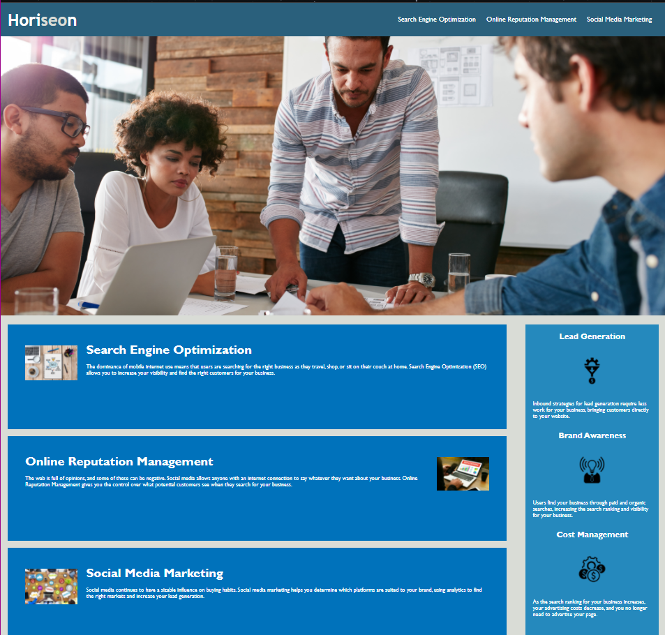

# CODE REFACTOR CHALLENGE

## CHALLENGE DESCRIPTION
    This challenge is to update the given Horiseon website with semantic HTML elements, as well asd accessibility standards. Without changing the overall structure of the page. 

## TABLE OF CONTENTS
  - [CHALLENGE DESCRIPTION](#challenge-description)
  - [TABLE OF CONTENTS](#table-of-contents)
  - [USER STORY](#user-story)
  - [SITE LINK / SCREENSHOT](#site-link--screenshot)
  - [CHALLENGE REQUIREMENTS](#challenge-requirements)
  - [HOW I MET THE REQUIREMENTS (snipits)](#how-i-met-the-requirements-snipits)
  - [RESOURCES](#resources)


## USER STORY
AS A marketing agency
I WANT a codebase that follows accessibility standards
SO THAT our site is optimized for search engines
## SITE LINK / SCREENSHOT
*   [Deployed Link!](https://nbrown225.github.io/code-refactor-challenge/)
*   

## CHALLENGE REQUIREMENTS
    - WHEN I view the source code
      * THEN I find semantic HTML elements
    - WHEN I view the structure of the HTML elements
      * THEN I find that the elements follow a logical structure independent of styling and positioning
    - WHEN I view the icon and image elements
      * THEN I find accessible alt attributes
    - WHEN I view the heading attributes
      * THEN I find that they fall in sequential order
    - WHEN I view the title element
      * THEN I find a concise, descriptive title

## HOW I MET THE REQUIREMENTS (snipits)
- Added description to the title
  -   ``` <title>About Horiseon</title>``` 
- Added the following to give information to sections of the page
  -   ```<header>```
  -   ```<article>```
  -   ```>section>```
  -   ```<footer>```

- Assurd Heading Tags followed sequential order
  -   ```<h1>Hori<span id="seo">seo</span>n</h1>```
  -   ```<h2>Search Engine Optimization</h2>```
  -   ```<h3>Cost Management</h3>```
  -   ```<h4>Made with ❤️️ by Horiseon</h4>```
    ### IMPEMENTED DRY CODING
- Implemented DRY CODING by removing repeated code and adding CLASSES and ID's to sections with the same styling
  
  

    ### ACCESSIBILITY
-   Added alt tags to explain the images
    -   ``````
    
## RESOURCES
For Semantic Elements
https://www.w3schools.com/html/html5_semantic_elements.asp